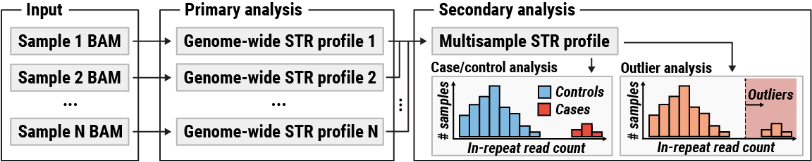

# ExpansionHunter Denovo

ExpansionHunter Denovo (EHdn) is a suite of tools for detecting novel expansions
of short tandem repeats (STRs). EHdn is intended for analysis of a collection of
BAM/CRAM files containing alignments of short (100-200bp) reads.

As shown in the figure above, the analysis workflow consists of two steps.
During the first step, genome-wide STR profiles are extracted from the input BAM
files. The STR profiles contain information about reads that originate in STRs
longer than the read length. The second step involves comparing STR profiles to
each other. The type of comparison depends on the dataset:

| Analysis type | Dataset                                                         |
|---------------|-----------------------------------------------------------------|
| Case-control  | Cases are enriched in expansions of the same STR                |
| Outlier       | Only a few cases are expected to contain the same STR expansion |

For example, if a case-control analysis is applied to a dataset consisting of
ALS patients and healthy controls, then it is expected to flag the GGCCCC repeat
in *C9orf72* gene as highly significant. On the other hand, if cases consist of
samples from patients with diverse phenotypes, it might be appropriate to assume
that there is no enrichment for any specific expansion and hence the
case-control analysis is not appropriate. In this situation, an outlier analysis
can be used to flag repeats that are expanded in a small proportion of cases
compared to the rest of the dataset.

## Features

- Approximate location and nucleotide composition of STRs are inferred
automatically.
- A single BAM/CRAM file can be analyzed in about 30 mins to 5 hours on a
typical workstation. The exact runtime will depend on the sensitivity settings.

## Limitations

- STRs shorter than the read length are ignored; the program is appropriate
  only for detecting expansions that exceed the read length.
- The location of each reported STR is approximate (up to about 500bp-1Kbp)
- STRs are not genotyped; the program reports a depth-normalized count of reads
  originating inside each STR; this count can be used as a very approximate
  measure of the repeat length
- To achieve best results all samples must be sequenced on the same instrument
  to similar coverage, have the same read and fragment lengths, and be subjected
  to the same computational pre-processing (e.g. reads must be aligned by the
  same aligner)

## Documentation

See [documentation](documentation/00_Introduction.md) for installation
instructions, usage guide, and description of file formats.

## License

ExpansionHunter Denovo is provided under the terms and conditions of the [Apache
License Version 2.0](LICENSE.txt). It relies on several third party packages
provided under other open-source licenses, please see [COPYRIGHT.txt](COPYRIGHT.txt)
for additional details.
