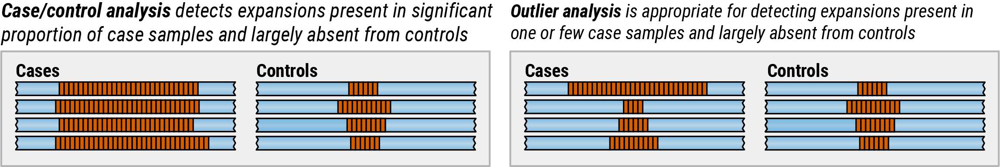

# Before you begin

ExpansionHunter Denovo (EHdn) can be used to analyze a collection of BAM/CRAM
files containing alignments of short (100-200bp) reads. For best results, the
samples should be sequenced on the same instrument to similar coverage of at
least 30x. All data should be aligned with the **same short-read aligner**
ideally without any post-processing steps such as indel realignment or
recalibration.

Your dataset should contain one or more samples that are suspected to harbor a
repeat expansion and a set of controls. If the controls are not available,
consider using
[Illumina Polaris](https://github.com/Illumina/Polaris/wiki/HiSeqX-Diversity-Cohort)
dataset.

## Choosing between case/control and outlier analysis

EHdn supports two secondary analysis types: case/control analysis and outlier
analysis. Case/control analysis is appropriate for detecting expansions present
in a significant proportion of cases and largely absent from controls. Outlier
analysis, on the other hand, should be used when an expansion might be present
only in one or few case samples.

**Example 1** If the set of cases consists of many related individuals
exhibiting the same phenotype then a **case/control** analysis may be
appropriate.

**Example 2** If the set of cases consists of ALS patients, the **case/control**
analysis is expected to flag the GGCCCC repeat in *C9orf72* gene as highly
significant.

**Example 3** If the set of cases is an undiagnosed rare disease cohort
exhibiting a mix of phenotypes, it is unlikely that there is an enrichment for
any specific expansion and hence the **outlier** analysis is appropriate.
