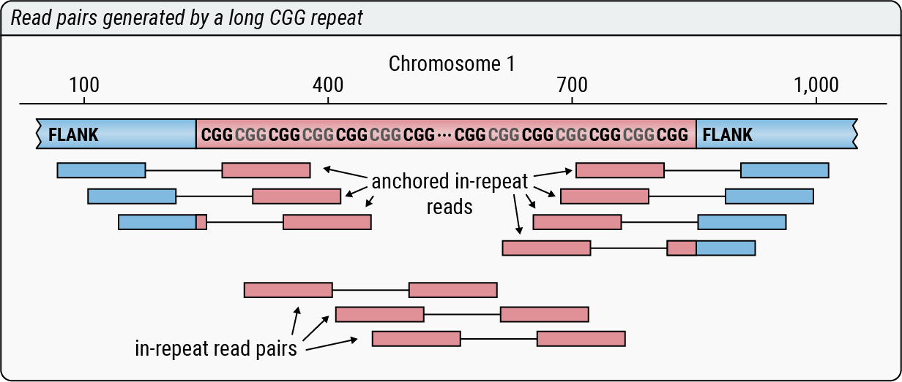

# Computing STR profiles

EHdn performs a genome-wide search for STRs whose size exceeds the read length.
The program does this by collecting the following read-level evidence:

- **Anchored in-repeat reads**: reads that originate inside STRs and their
  mates (called the **anchors**) originate in the surrounding flanking sequence.
- **In-repeat read pairs** are read pairs where both mates originate inside
  the same STR.

The files containing summaries of identified anchored in-repeat reads and
in-repeat read pairs are called **STR profiles**. STR profiles generated by
EHdn are JSONs containing a separate record for each repeat unit (motif).

For example, consider a CGG repeat depicted in the figure below.

There are 7 anchored in-repeat reads and 3 in-repeat read pairs
originating from this repeat. They give rise to the following entry in the STR
profile file.

```json
"CCG": {
    "AnchoredIrrCount": 7,
    "IrrPairCount": 3,
    "RegionsWithIrrAnchors": {
        "chr1:100-1000": 7
    },
    "RepeatUnit": "CCG"
}
```

STR profiles are computed by the `profile` command as follows.

```bash
ExpansionHunterDenovo profile \
        --reads input.bam \
        --reference reference.fasta \
        --output-prefix output \
        --min-anchor-mapq 50 \
        --max-irr-mapq 40
```

| Parameter         | Description                                     |
|-------------------|-------------------------------------------------|
| --reads           | The BAM/CRAM file to analyze                    |
| --reference       | The FASTA file to which the reads were aligned  |
| --output-prefix   | Common prefix for the output files              |
| --min-anchor-mapq | Minimum MAPQ for anchor reads                   |
| --max-irr-mapq    | Maximum MAPQ for in-repeat reads                |

## Supplementary files generated by the `profile` command

In addition to the STR profile itself, the `profile` command generates
supplementary files `<output prefix>.locus.tsv`, `<output prefix>.motif.tsv`,
and `<output prefix>.reads.tsv`. The last file is generated when `--log-reads`
command-line parameter is set.

The `<output prefix>.locus.tsv` file summarizes information about all identified
anchored in-repeat reads. The first four columns of this file give the location
and motif of the STR. The fifth and sixth columns contain the raw and
depth-normalized (to 30x) counts of anchored in-repeat reads identified at the
region. Finally, the last column provides the estimated repeat expansion size.
This estimate is computed assuming that the expansion is heterozygous. If STR
boundaries can be accurately annotated, a more accurate size estimate could be
obtained using
[a targeted STR genotyper](https://github.com/Illumina/ExpansionHunter). Here is
an example output file describing two STRs.

```
contig  start  end   motif  num_anc_irrs  norm_num_anc_irrs  het_str_size
StrA    1771   2053  AGC    32            24.96              133
StrB    1757   2154  CCG    22            17.16              107
```

The `<output prefix>.motif.tsv` file summarizes information about all identified
in-repeat read pairs. This file contains raw and depth-normalized counts of
in-repeat read pairs for each motif. Here is an example.

```
motif  num_paired_irrs  norm_num_paired_irrs
AGC    2                1.56
CCG    46               35.89
```

Finally, the optional file `<output prefix>.reads.tsv` contains the detailed
information about all informative read pairs. Here is a description of each
column.

| Column    | Description                                                                                               |
|-----------|-----------------------------------------------------------------------------------------------------------|
| pair_type | Type of read pair: in-repeat read and its anchor (`anchored_irr`) or pair of in-repeat reads (`irr_pair`) |
| motif     | Motif of the in-repeat read(s); if motifs differ, they are given by `<read_motif>_<mate_motif>`           |
| read_type | Type of read: anchor read (`anchor`) or in-repeat read (`irr`)                                            |
| read_pos  | Position where the read is placed by the aligner (`unaligned` if the read is not aligned)                 |
| mate_type | Type of mate: anchor read (`anchor`) or in-repeat read (`irr`)                                            |
| mate_pos  | Position where the mate is placed by the aligner (`unaligned` if the mate is not aligned)                 |
| name      | Identifier of the read pair                                                                               |

Here is an example describing three read pairs.

```
pair_type    motif   read_type  read_pos        mate_type  mate_pos        name
anchored_irr CCG     irr        chr1:1734-1735  anchor     chr1:1734-1735  ZXZ555:98:HTJW3CZXM:1:2204
irr_pair     AGC     irr        chr2:2431-2432  irr        chr2:2523-2524  ZXZ555:98:HTJW3CZXM:1:2205
irr_pair     AGC_CCG irr        unaligned       irr        unaligned       ZXZ555:98:HTJW3CZXM:1:2206
```

## Generating a "BAMlet" for a given repeat region

Direct analysis of reads supporting a given repeat expansion call offers a
powerful way to assess EHdn findings. To help with this task, we implemented
a script `make-bamlet.py` that generates a small BAM file (BAMlet) with
reads aligned to the repeat region and their mates. The script extends a given
region (+/-2Kb), extracts reads from the extended region, and then extracts
mates of the collected reads located anomalously far away (>1Kb).

The script can be run like so.

```bash
./make-bamlet.py \
    --bam input_full_bam.bam \
    --bamlet output_bamlet.bam \
    --region chr2:6123657-6123714
```
