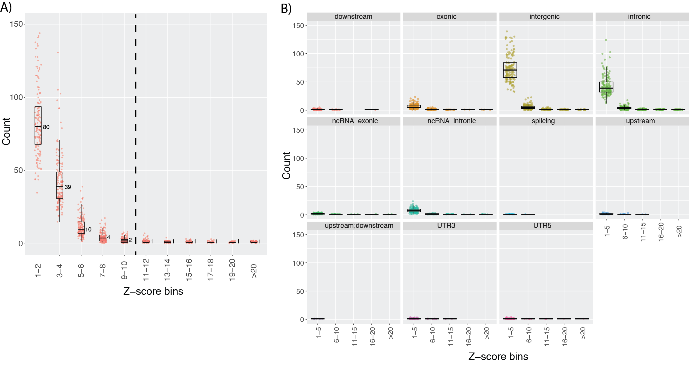
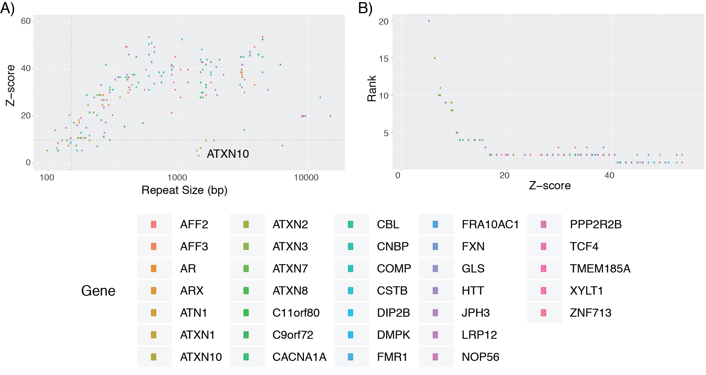

# Interpreting Outlier Analysis Hits

> This guide will help interpret hits from the outlier analysis.

We provide three components which will aid in the interpretation of the output file from running the Outlier Analysis (secondary scripts).

At this point, you have likely run the *profile* and *outlier.py* steps of ExpansionHunter denovo, and the resulting file you are looking at has candidate repeat expansions with an associated Z-score. 

The three components include:
- Using annotation to assist in the filtering of candidate insertions
- Understanding the set of rare (high z-score) insertions in a healthy individual
- Informing the set of cutoffs from simulated pathogenic repeat expansions

## Annotating Output files

*\<Text + Script from Mark here\>*

### Annotations applied to known pathogenic simulations
Each of the 35 pathogenic simulations (Supp Table 3 and Supp Table 4) were annotated using the ANNOVAR-based method. Their resulting 'region' breaks down as follows:
- Exonic: (23 - AR, ARX, ATN1, ATXN1, ATXN2, ATXN7, CACNA1A, COMP, DMPK, HTT, JPH3, PPP2R2B, ATXN3, C11orf80, CBL, CSTB, DIP2B, FMR1, GLS, LRP12, NOP56, TMEM185A, XYLT1)
- UTR5 or UTR3: (5 - TCF4, AFF2, C9orf72, FRA10AC1, ZNF713)
- Splicing: (1 - AFF3) 
- Intronic: (3 - ATXN10, CNBP, FXN)
- ncRNA\_exonic (1 - ATXN8/ATXN8OS)
- Intergenic: (0)
- No-call (2 - NUTMB1, NOTCH2NLC)

Furthermore, for the 33 called REs, all of the affected genes were correctly labeled. 

One relevant interpretation of this is that setting a cutoff to remove 'intergenic' REs is good as a first pass, since no known pathogenic events are intergenic. Additional filters can be applied with annotated outlier files, including gene-list based filters.  

## Rare insertions in healthy individuals

Each individual within our control cohort, 150 people from the Polaris Diversity Cohort, was compared as a 'case' within the outlier analysis script against the remaining 149. This gives us an estimate of what to expect from a healthy individual when examining candidate repeat expansions. 

Here, each of those individual outlier analyses have been run (n=150) and plotted to inform the set of rare insertions per individual. 

In part (A), the Z-scores of all 150 individuals (red dots) are binned and tallied. The majority of hits within an output file are of Z-score < 10, and setting a z-score cutoff of 10 leaves ~5 candidate REs. 

In part (B), these repeats are annotated by genic region (see above script + documentation). As expected, the majority of repeats identified fall within intergenic or intronic regions. 

## Interpreting Simulated Pathogenic Repeats

In our simulation of expanded repeats, the expanded allele is present in the heterozygous (hemizygous for X-chrom) state. The relationship between Z-score, rank, and expanded size (in basepairs) helps guide the setting of cutoffs for narrowing down the search space in an applied setting. 

In part (A), each repeat expansion is plotted as Z-score versus Repeat Size. With the exception of a few simulations (including those of ATXN10), as the repeat size extends beyond the readlength (150bp, dashed vertical line) the Z-score increases above 10. When paired with the knowledge of rare insertions within healthy individuals, we find that setting the Z-score cutoff of ~10 captures nearly all simulated pathogenic events, and removes the majority of noisey, less-rare calls. 

In part (B), the Z-score is compared to the rank, and if a z-score threshold of 10 is used, then the pathogenic events will almost entirely be within the top 5 hits within the outlier output file. 

