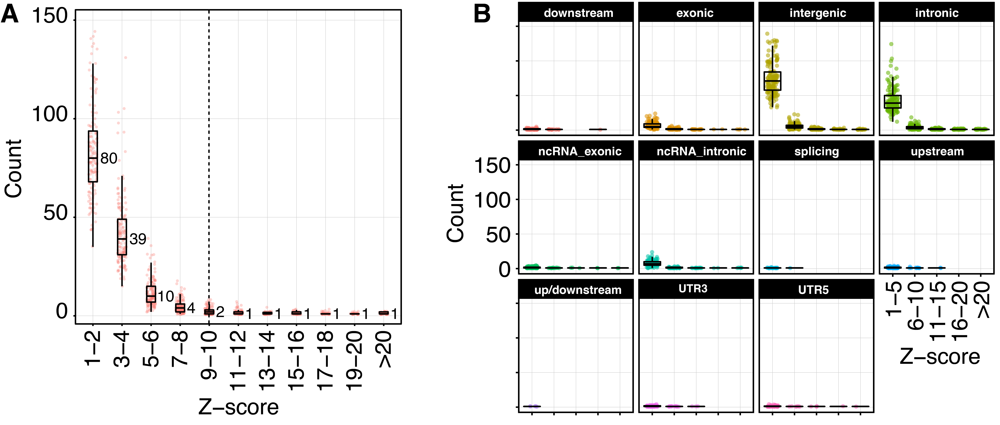
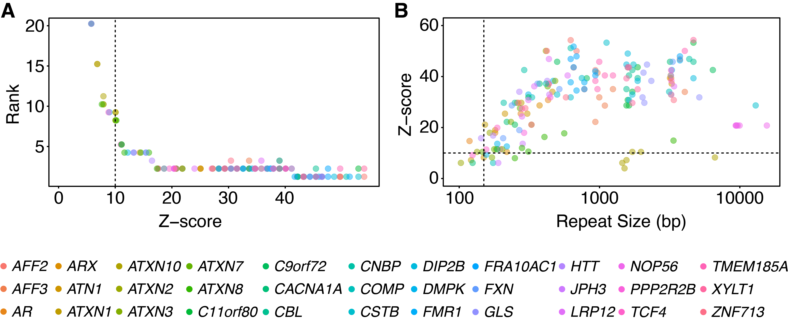

# Repeat prioritization strategies during locus outlier analysis

The main takeaway from this document is that it may be reasonable to
restrict the repeat expansion search space to genic regions or even a small
subset of the relevant genes. This may help to increase the detection power when
analyzing data sets containing a small number of case samples. In this document
we detail the impact of genic filtering, and inform relevant cutoffs for Z-score
thresholds when analyzing outlier samples at the locus level. 

## Known pathogenic repeats are located in genic regions

We used [ANNOVAR-based annotation script](08_Annotation.md) to annotate the output locus
files from simulations of 35 known pathogenic repeats. Here is the breakdown of annotations:

| Annotation    | Repeat gene                                     |
|---------------|-------------------------------------------------|
| Exonic        | *AR*, *ARX*, *ATN1*, *ATXN1*, *ATXN2*, *ATXN7*, *CACNA1A*, *COMP*, *DMPK*, *HTT*, *JPH3*, *PPP2R2B*, *ATXN3*, *C11orf80*, *CBL*, *CSTB*, *DIP2B*, *FMR1*, *GLS*, *LRP12*, *NOP56*, *TMEM185A*, *XYLT1* |
| UTR           | *TCF4*, *AFF2*, *C9orf72*, *FRA10AC1*, *ZNF713* |
| Splicing      | *AFF3*                                          |
| Intronic      | *ATXN10*, *CNBP*, *FXN*                         |
| ncRNA\_exonic | *ATXN8/ATXN8OS*                                 |
| No annotation | *NUTMB1*, *NOTCH2NLC*                           |

The table shows that most known pathogenic repeats are located in genic regions. Note,
ExpansionHunter Denovo locus script outputs a ~1kb region centered on the identified repeat, 
so if a repeat is within ~500bp of an exon then it will be labeled as exonic. 

## Rare expansions in healthy individuals

For this analysis we used [Illumina Polaris Diversity Cohort](https://github.com/Illumina/Polaris/wiki/HiSeqX-Diversity-Cohort)
consisting of 150 samples selected from the [International Genome Sample Resource](https://www.internationalgenome.org/)
(formerly the 1000 Genomes Project) based on population diversity.

After [STR profiles](05_Computing_profiles.md) have been generated for all
samples, we repeatedly ran the [outlier analysis](04_Outlier_quickstart.md)
designating each sample as the "case" and using the remaining 149 samples as
"controls". We then collected the Z-scores produced by this analysis.

As shown in the Panel A of the figure below, the vast majority of Z-scores 
is less than 10, with only about 5 repeats, on average,
exceeding this threshold. The Panel B shows that the vast majority of the
identified repeats in this healthy population cohort fall within intergenic 
and intronic regions. 

## Large pathogenic expansions correspond to high Z-scores

To show that large pathogenic expansions correspond to high Z-scores, we
simulated expansions of the 35 pathogenic repeats. The relationship between
Z-scores, ranks, and repeat sizes (in base pairs) is shown in the figure below.

Panel A shows that with a few exceptions as the repeat size exceeds the read
length (150bp, dashed vertical line), the Z-score increases above 10 (an upper
bound for the vast majority of rare expansions in controls). Panel B shows that
repeats corresponding to the Z-score of 10 or above will almost always
correspond to a outlier ranking in the top 5, with many expansions ranked first. 

